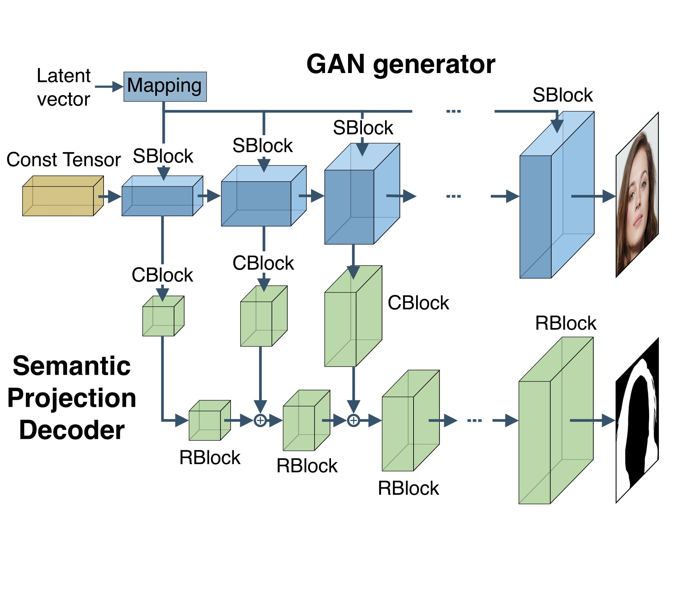
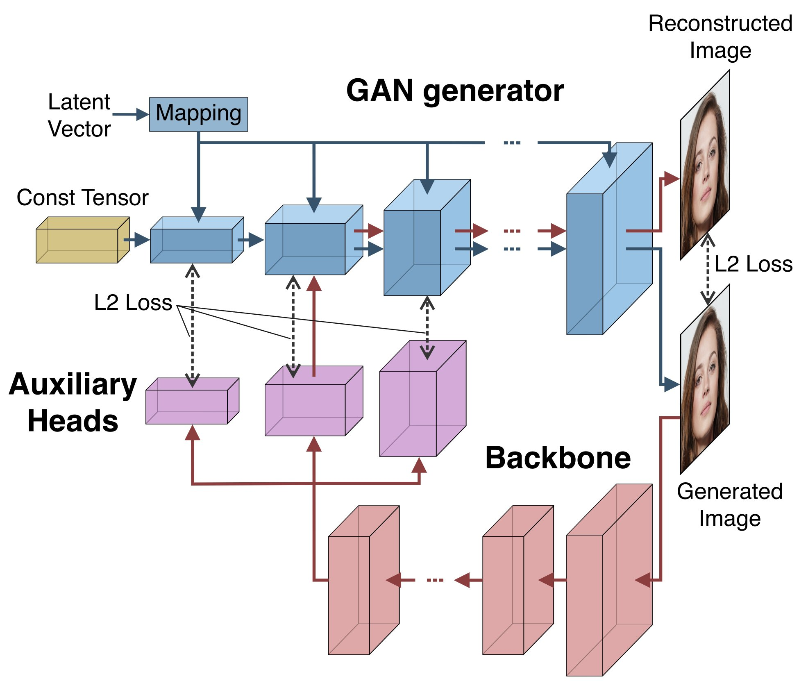

# Learning High-Resolution Domain-Specific Representations with a GAN Generator

<p align="center">
    
</p>

This repository contains the pytorch implementation for the method described in the paper:

> **Learning High-Resolution Domain-Specific
Representations with a GAN Generator**<br>
> [Danil Galeev](https://github.com/denemmy),
> [Konstantin Sofiiuk](https://github.com/ksofiyuk),
> [Danila Rukhovich](https://github.com/filaPro),
> [Michael Romanov](https://github.com/RomanovMikeV),
> [Olga Barinova](https://github.com/OlgaBarinova),
> [Anton Konushin](https://scholar.google.com/citations?user=ZT_k-wMAAAAJ)
> <br>
> Samsung AI Center Moscow <br>
> https://arxiv.org/abs/2006.10451

> **Abstract**: *In recent years generative models of visual data have made a great progress, and now they are able to produce images of high quality and diversity. In this work we study representations learnt by a GAN generator. First, we show that these representations can be easily projected onto semantic segmentation map using a lightweight decoder. We find that such semantic projection can be learnt from just a few annotated images. Based on this finding, we propose LayerMatch scheme for approximating the representation of a GAN generator that can be used for unsupervised domain-specific pretraining. We consider the semi-supervised learning scenario when a small amount of labeled data is available along with a large unlabeled dataset from the same domain. We find that the use of LayerMatch-pretrained backbone leads to superior accuracy compared to standard supervised pretraining on ImageNet. Moreover, this simple approach also outperforms recent semi-supervised semantic segmentation methods that use both labeled and unlabeled data during training. Source code for reproducing our experiments will be available at the time of publication.*

### Algorithm

<p align="center">
    
    
</p>

### Results


### Installation

- Clone this repo and install dependencies:
```bash
git clone https://github.com/saic-vul/GAN-high-resolution-representation.git
cd GAN-high-resolution-representation
pip3 install -r requirements.txt
```

- Download [stylegan2-models](https://drive.google.com/open?id=1uCAo0X1kdXM9wPmt_gcdnpmUDPGmACkx) converted to pytorch and unzip archive to `stylegan2-models` directory.

- Download [annotated samples](https://drive.google.com/open?id=143dRAyJcRDqygepSz8lIr8ElAnwF3xp_) and unzip archive to `experiments` directory to reproduce experiment with FFHQ hair segmentation.

Be sure that your project structure is 
```
    .
    ├── configs
    ├── experiments
    │   ├── ffhq-hair
    │   |   ├── checkpoints
    |   |   ├── data
    |   |   └── generated
    ├── lib
    ├── stylegan-models
    │   ├── cars.tar
    |   └── ffhq.tar
    └── ...
```

### Semantic Projection

See [SEMANTIC_PROJECTION.md](SEMANTIC_PROJECTION.md) for instructions for semantic projection.

### Layer Match

See [LAYER_MATCH.md](LAYER_MATCH.md) for instructions for LayerMatch scheme.

### Interactive annotator

See [ANNOTATOR.md](ANNOTATOR.md) for more instructions.
